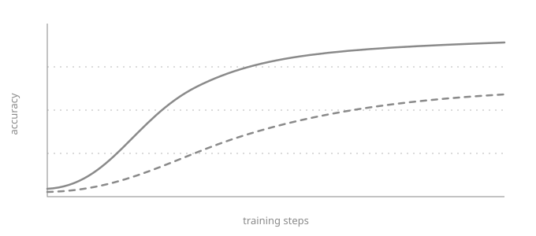

这是一篇草稿：运行 `npm run dev` 时可以看到，正式发布的站点里不会出现。它演示了文章里能用的所有写法，全部是普通的 Markdown，不需要导入任何组件。

## 页边注

脚注照常写：正文里放一个标记，注释内容写在下面任意位置。[^margin] 屏幕够宽时，注释排在页边，与标记齐平；在手机上，标记变成一个按钮，点一下就在原地展开。

注释里可以用**强调**、`代码`和链接，相邻的第二条注释会自动排在第一条下面。[^stack]

[^margin]: 就像这一条。页边注让视线留在当前位置，不必跳到页尾再回来，这个做法借鉴自 Tufte 的书 [@tufte2006beautiful]。

[^stack]: 正文里写 `[^stack]`，另起一行写 `[^stack]: …`。

## 文献引用

文献只需在 frontmatter 的 `bibliography` 里列一次，正文用 key 引用：低秩适配 [@hu2021lora] 建立在 Transformer [@vaswani2017attention] 之上。多个 key 可以共用一个标记 [@hu2021lora; @tufte2006beautiful]。

一篇文献第一次被引用时，详细信息显示在页边；之后再引用只显示编号，点击即可展开。文末会自动生成带编号的参考文献列表。

## 表格

| 方法 | 可训练参数 | 准确率 |
| :-- | --: | --: |
| 全量微调 | 100% | 91.2 |
| LoRA，秩 8 | 0.24% | 90.8 |
| LoRA，秩 64 | 1.9% | 91.1 |

表 1：紧跟在表格下面、以「表 1：」开头的段落会成为表格的标题。这里的数字是为演示编的。

表格太宽时，在小屏幕上会横向滚动，不会把页面撑破。

## 图片



## 代码

代码块有适配明暗两种主题的语法高亮、语言标签和复制按钮。

```python
def lora_update(W, A, B, scale):
    """Low-rank update: W' = W + scale * B @ A."""
    return W + scale * (B @ A)
```

## 公式

公式用 LaTeX 书写。行内公式如 $W' = W + \gamma BA$ 排在句子里，独立公式单独占一行：

$$
\mathcal{L}(\theta) = -\frac{1}{N} \sum_{i=1}^{N} \log p_\theta(y_i \mid x_i)
$$

各种环境的用法和 LaTeX 里一样。`align` 和 `equation` 会自动编号，`\tag` 可以手动指定标号：

$$
\begin{align}
h &= W_0 x + \Delta W x \\
  &= W_0 x + \frac{\alpha}{r} B A x
\end{align}
$$

$$
\operatorname{softmax}(z)_i = \frac{e^{z_i}}{\sum_j e^{z_j}} \tag{$\star$}
$$

矩阵和分段函数：

$$
A = \begin{bmatrix} a_{11} & a_{12} \\ a_{21} & a_{22} \end{bmatrix},
\qquad
f(x) = \begin{cases} x & x \ge 0 \\ \alpha x & x < 0 \end{cases}
$$

注释[^math]和表格里也可以写公式。从页面上复制公式，得到的是它的 LaTeX 源码。

[^math]: 例如 $\lVert \Delta W \rVert_F \le \epsilon$，排在页边。

## 折叠块

不是每位读者都需要的内容，比如一段推导、一个证明、一段较长的补充说明，可以收进折叠块，点一下标题才展开。写法是 HTML 自带的 `<details>`，标签和正文之间要空一行：

```html
<details>
<summary>标题</summary>

正文、公式、表格、代码……

</details>
```

<details>
<summary>推导：平均数为什么使平方误差最小</summary>

设 $f(c) = \sum_{i=1}^{n} (x_i - c)^2$。对 $c$ 求导，并令导数为零：

$$
f'(c) = -2 \sum_{i=1}^{n} (x_i - c) = 0
\quad\Longrightarrow\quad
c = \frac{1}{n} \sum_{i=1}^{n} x_i . \tag{1}
$$

折叠块里的注释和引用不排到页边，点击标记后在原地展开。[^fold]

</details>

[^fold]: 就像这样。

## 引文与列表

> 引用的段落用一条竖线和更浅的颜色与正文区分。

1. 有序列表
2. 保留编号，

- 无序列表
- 保留圆点。

## 引用块

在 frontmatter 里写上 `citation: true`，文末就会多出下面这一节，以纯文本和 BibTeX 两种格式给出本文的引用信息。
